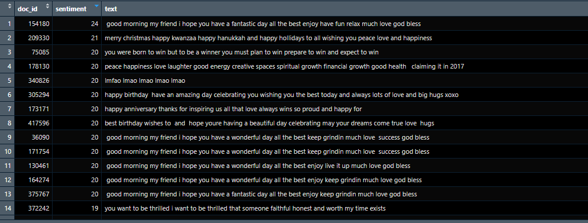
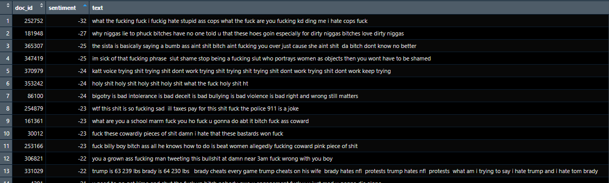

# Old
**Autor:** Nicolás Montejano  
**Fecha:** 2024-03-18  

## Nicolás Montejano Pisonero - 3º INSO B
## Análisis de Sentimiento sobre Temas raros en Twitter

### Librerías y Directorios
```r
library(quanteda)
library(quanteda.textplots)
library(stringr)

setwd("C:\\Users\\nicom\\OneDrive\\Escritorio\\Universidad\\3ºINSO\\BusquedaAnalisis\\Actividad1")
ficheros_csv <- list.files(path = "russian-troll-tweets-master\\", pattern = "*.csv")
###LECTURA DE TWEETS

r
Copy code
data_frame_troll <- data.frame()
for (i in ficheros_csv) {
  lectura <- read.csv(paste0("russian-troll-tweets-master\\", i), header = TRUE, sep = ",")
  print(nrow(lectura))
  data_frame_troll <- rbind(lectura, data_frame_troll)
}
print(nrow(data_frame_troll))
names(data_frame_troll)
LIMPIEZA DE DATAST
r
Copy code
##QUITAMOS COLUMNAS
df_trolls <- subset(data_frame_troll, select = c("author", "content", "region", "language", "publish_date", "post_type", "account_type", "account_category"))

#FACTORIZAMOS
df_trolls$region <- as.factor(df_trolls$region)
df_trolls$language <- as.factor(df_trolls$language)
df_trolls$post_type <- as.factor(df_trolls$post_type)
df_trolls$account_type <- as.factor(df_trolls$account_type)
df_trolls$account_category <- as.factor(df_trolls$account_category)
summary(df_trolls)

#Fechas
df_trolls$publish_date <- as.Date(df_trolls$publish_date, format = "%m/%d/%Y")

# Nos quedamos solo con los tweets que están en inglés
datos_filtrados <- subset(df_trolls, language == "English")
save(datos_filtrados, file = "datos_filtrados.rda")

# Limpiamos el dataset de caracteres raros
datos_filtrados$content <- str_replace_all(datos_filtrados$content,
                                           pattern = "https?://([^/\\s]++)\\S*+|http?://([^/\\s]++)\\S*+",
                                           replacement = "")

# Limpiamos el dataset de links, menciones, etc.
datos_filtrados$content <- gsub("(#\\w+)|(http\\S+)|(https\\S+)|(&amp;)|(@\\w+)|(RT)", "", datos_filtrados$content)

# Convertimos a minúsculas
datos_filtrados$content <- tolower(datos_filtrados$content)

# Limpiamos emojis y caracteres raros
datos_filtrados$content <- gsub("[\\x{1F600}-\\x{1F6FF}|\\x{2600}-\\x{26FF}|\\x{2700}-\\x{27BF}|\\x{1F300}-\\x{1F5FF}|\\x{1F680}-\\x{1F6FF}|\\x{1F1E0}-\\x{1F1FF}|\\x{1F900}-\\x{1F9FF}|\\x{1F7E0}-\\x{1F7FF}|\\x{1F918}]", "", datos_filtrados$content, perl = TRUE)
datos_filtrados$content <- gsub("[^[:alnum:][:space:]]", "", datos_filtrados$content, perl = TRUE)

# Verificamos la limpieza
grep(pattern = "http", datos_filtrados$content, perl = T)
grep(pattern = "#", datos_filtrados$content, perl = T)

# Salvamos el objeto
save(datos_filtrados, file = "datos_filtrados.rda")
Búsqueda de "old"
r
Copy code
# Temas "raros" (pelo, perder peso...)
indices <- grep("old", datos_filtrados$content)

# Tomar los primeros X índices encontrados
primeros_X <- head(indices, 50)
Gráfico de Tweets

###Limpieza del Dataset

r
Copy code
Copy code
# Lo primero que tenemos que hacer es quitar las palabras que sean similares a "old" pero que no tengan nada que ver
# Para poder estudiar lo mejor posible el texto
# Definir las palabras que queremos eliminar
palabras_eliminar <- c("bold", "mold", "cold", "fold", "hold", "sold", "told", "golf", "gold", "mould")

# Función para eliminar las palabras
eliminar_palabras <- function(texto, palabras) {
  texto_limpio <- gsub(paste(palabras, collapse = "|"), "", texto)
  return(texto_limpio)
}

# Aplicar la función a la columna texto del dataset
datos_filtrados$content <- sapply(datos_filtrados$content, eliminar_palabras, palabras = palabras_eliminar)

# Ahora vamos a coger la muestra que solo hable de los temas relacionados con "old"
datos_filtrados <- subset(datos_filtrados, grepl("old", datos_filtrados$content))

# Salvamos el Objeto
save(datos_filtrados, file = "datos_filtrados_old.rda")
###Trolls de Derecha (RightTroll)

r
Copy code
Copy code
# Trolls de Derecha (RightTroll)
# Nos quedamos solo con los tweets de RightTroll
ds_right_old <- subset(datos_filtrados, account_category == "RightTroll")
save(ds_right_old, file = "ds_right_old.rda")
Tokens más predominantes con un CORPUS
r
Copy code
Copy code
# Creamos un CORPUS
corpus_right_old <- quanteda::corpus(ds_right_old$content)

docvars(corpus_right_old, "account_category") <- ds_right_old$account_category
docvars(corpus_right_old, "account_type") <- ds_right_old$account_type
docvars(corpus_right_old, "lengua") <- ds_right_old$language
docvars(corpus_right_old, "fecha") <- ds_right_old$publish_date
docvars(corpus_right_old, "autor") <- ds_right_old$author
docvars(corpus_right_old, "region") <- ds_right_old$region
docvars(corpus_right_old, "post_type") <- ds_right_old$post_type

summary(corpus_right_old)

# Asignamos tokens (elemento suele ser una palabra)
trolls_corpus_right_old <- tokens(corpus_right_old)

# Buscamos palabras que contienen "old"
old_tweets <- kwic(trolls_corpus_right_old, "old")
View(old_tweets)

# Limpiamos el corpus de números, símbolos, URL, etc.
tok_tweets <- quanteda::tokens(corpus_right_old,
                               what = "word",
                               remove_numbers = TRUE,
                               remove_punct = TRUE,
                               remove_symbols = TRUE,
                               remove_separators = TRUE,
                               remove_url = TRUE)

# Filtramos las stopwords del inglés
tok_tweets <- tokens_select(tok_tweets,
                            pattern = stopwords("en"),
                            selection = "remove")

# Creamos matrices de frecuencia que contienen tokens y su aparición en el dataset
myStemMat <- dfm(tok_tweets)

# Mostramos las palabras que más aparecen
topfeatures(myStemMat, 100)

# Creamos un bigrama
tok_tweets_2 <- tokens_ngrams(tok_tweets,
                               n = 2)
myStemMat <- dfm(tok_tweets_2)

# Mostramos el top 100 de palabras
topfeatures(myStemMat, 100)

# Creamos una nube de palabras
set.seed(100)
png(filename = "imagenes/old_right.png",
    width = 3000,
    height = 3000)

textplot_wordcloud(myStemMat,
                   min_count = 10,
                   random_order = FALSE,
                   rotation = 0,
                   color = RColorBrewer::brewer.pal(8, "Dark2"))

dev.off()
Nube de palabras para RightTroll

Trolls de Izquierda (LeftTroll)
r
Copy code
Copy code
# Trolls de Izquierda (LeftTroll)
load("datos_filtrados.rda")


# Nos quedamos solo con los tweets de LeftTroll
ds_left_old <- subset(datos_filtrados, account_category == "LeftTroll")
save(ds_left_old, file = "ds_left_old.rda")
r
Copy code
# Creamos un CORPUS
corpus_left_old <- quanteda::corpus(ds_left_old$content)

docvars(corpus_left_old, "account_category") <- ds_left_old$account_category
docvars(corpus_left_old, "account_type") <- ds_left_old$account_type
docvars(corpus_left_old, "lengua") <- ds_left_old$language
docvars(corpus_left_old, "fecha") <- ds_left_old$publish_date
docvars(corpus_left_old, "autor") <- ds_left_old$author
docvars(corpus_left_old, "region") <- ds_left_old$region
docvars(corpus_left_old, "post_type") <- ds_left_old$post_type

summary(corpus_left_old)

# Asignamos tokens (elemento suele ser una palabra)
trolls_corpus_left_old <- tokens(corpus_left_old)

# Buscamos palabras que contienen "old"
old_tweets <- kwic(trolls_corpus_left_old, "old")
View(old_tweets)

# Limpiamos el corpus de números, símbolos, URL, etc.
tok_tweets <- quanteda::tokens(corpus_left_old,
                               what = "word",
                               remove_numbers = TRUE,
                               remove_punct = TRUE,
                               remove_symbols = TRUE,
                               remove_separators = TRUE,
                               remove_url = TRUE)

# Filtramos las stopwords del inglés
tok_tweets <- tokens_select(tok_tweets,
                            pattern = stopwords("en"),
                            selection = "remove")

# Creamos matrices de frecuencia que contienen tokens y su aparición en el dataset
myStemMat <- dfm(tok_tweets)

# Mostramos las palabras que más aparecen
topfeatures(myStemMat, 100)

# Creamos un bigrama
tok_tweets_2 <- tokens_ngrams(tok_tweets,
                               n = 2)
myStemMat <- dfm(tok_tweets_2)

# Mostramos el top 100 de palabras
topfeatures(myStemMat, 100)

# Creamos una nube de palabras
set.seed(100)
png(filename = "imagenes/old_left.png",
    width = 3000,
    height = 3000)

textplot_wordcloud(myStemMat,
                   min_count = 10,
                   random_order = FALSE,
                   rotation = 0,
                   color = RColorBrewer::brewer.pal(8, "Dark2"))

dev.off()
Nube de palabras para LeftTroll

Conclusiones
Después de analizar los tweets relacionados con la palabra "old" de los trolls rusos tanto de derecha como de izquierda, podemos observar algunas diferencias en los temas predominantes:

RightTroll: Los temas predominantes incluyen "old people", "old white", "old man", y "old woman".
LeftTroll: Los temas predominantes incluyen "old white", "old men", "old people", y "old woman".
Ambos grupos parecen centrarse en discusiones relacionadas con personas mayores, pero los términos específicos pueden diferir ligeramente entre ellos.

Análisis de Sentimientos
RightTroll

r
Copy code
Copy code
library(tidytext)
library(tidyverse)
library(syuzhet)
library(dplyr)
library(textdata)
library(ggplot2)
r
Copy code
### Análisis de Sentimientos
load("ds_right_old.rda")

# Dividir los tweets en palabras y crear un tidy dataset
ds_tweets_tidy <- ds_right_old %>%
  unnest_tokens(word, content)

# Aplicar un análisis de sentimiento a esos Tweets
tweets_sentiment <- ds_tweets_tidy %>%
  inner_join(get_sentiments("afinn"), by = "word") %>%
  inner_join(ds_right_old %>% select(tweet_id, content), by = "tweet_id") %>%
  group_by(doc_id = tweet_id) %>%
  summarise(sentiment = sum(value), text = first(content))

# Mostrar los resultados
tweets_sentiment %>%
  arrange(desc(sentiment))
  ```r
  

### Crear el gráfico de barras
```r
ggplot(data = tweets_sentiment, aes(x = sentiment)) +
  geom_bar(color = 'darkslategray', fill = 'steelblue') +
  xlab("Sentimiento") +
  ylab("Cantidad de Tweets") +
  ggtitle("Gráfico de Barras")
  ```r
 
  
  
  
  
##LeftTroll
 

  
  #ANALISIS DE SENTIMIENTOS
 ```r
Copy code
### Análisis de Sentimientos
load("ds_left_old.rda")


# Dividir los tweets en palabras y crear un tidy dataset
ds_tweets_tidy <- ds_left_old %>%
  unnest_tokens(word, content)

# Aplicar un análisis de sentimiento a esos Tweets
tweets_sentiment <- ds_tweets_tidy %>%
  inner_join(get_sentiments("afinn"), by = "word") %>%
  inner_join(ds_left_old %>% select(tweet_id, content), by = "tweet_id") %>%
  group_by(doc_id = tweet_id) %>%
  summarise(sentiment = sum(value), text = first(content))

# Mostrar los resultados
tweets_sentiment %>%
  arrange(desc(sentiment))

# Crear el gráfico de barras
ggplot(data = tweets_sentiment, aes(x = sentiment)) +
  geom_bar(color = 'darkslategray', fill = 'steelblue') +
  xlab("Sentimiento") +
  ylab("Cantidad de Tweets") +
  ggtitle("Gráfico de Barras")
 ```r
   