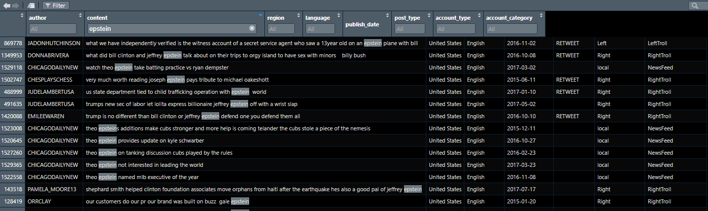
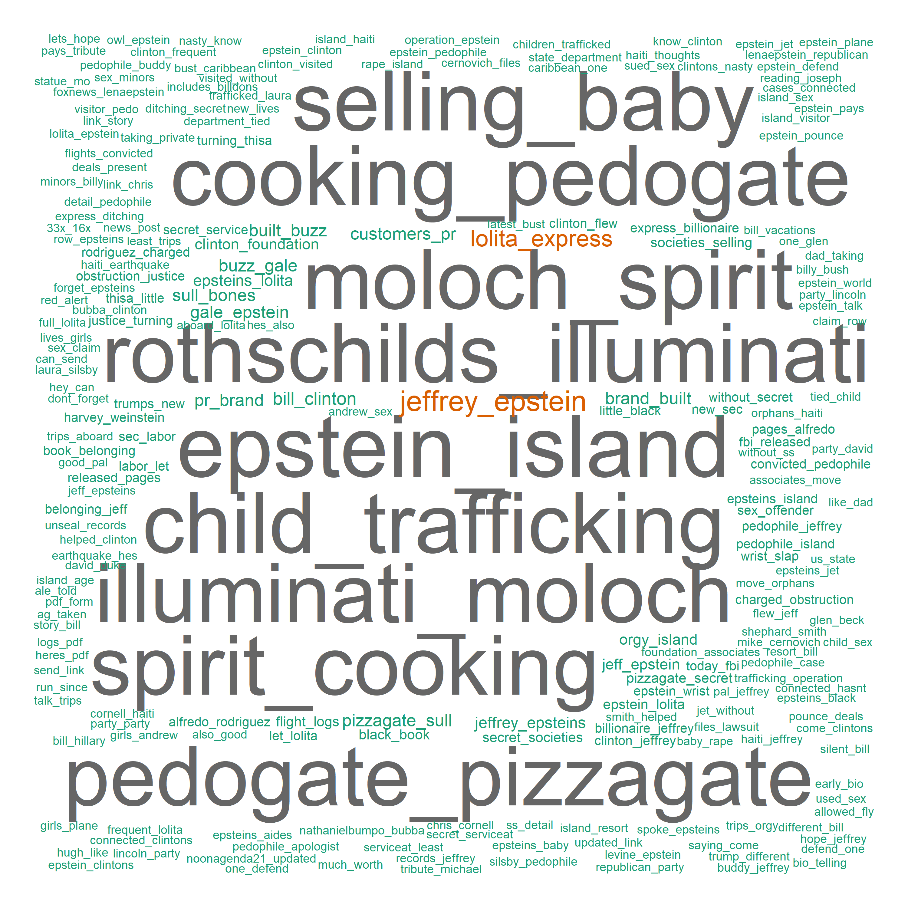
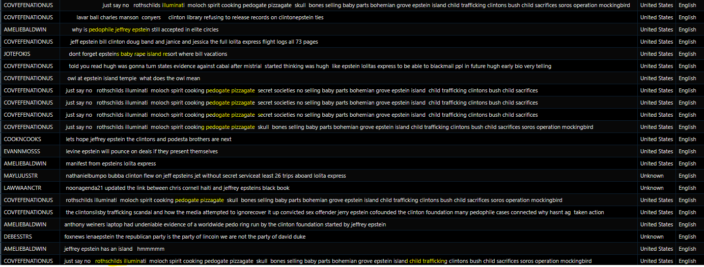
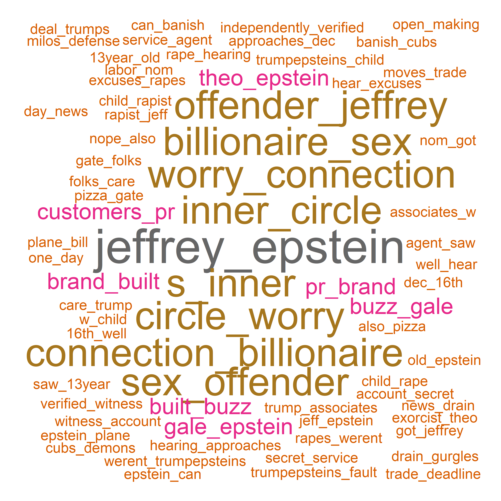
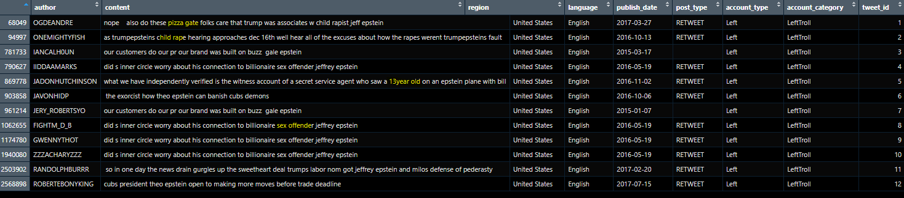
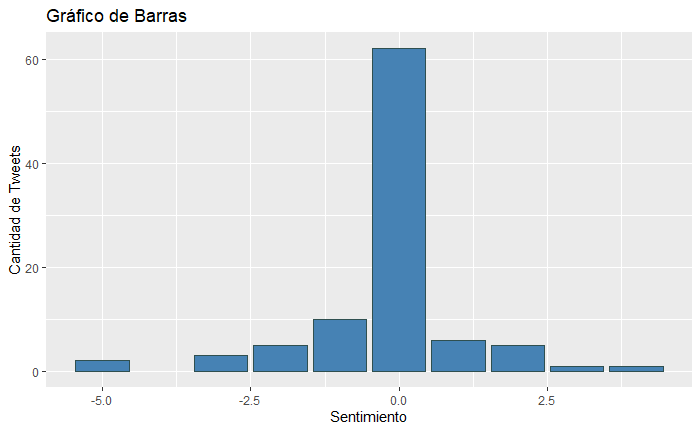
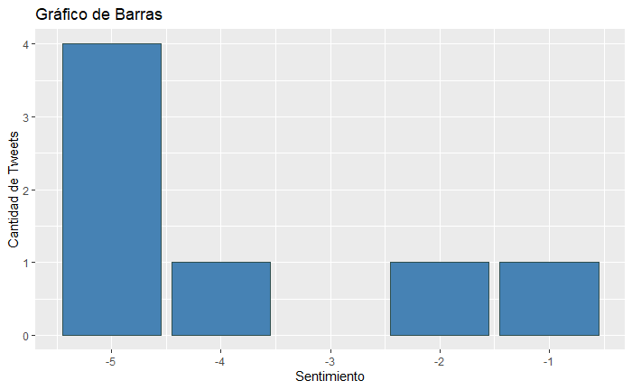
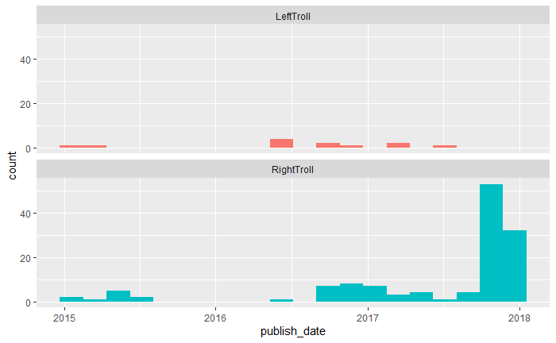

  # Nicolas Montejano Pisonero 3ºB
  
# EPSTEIN,  analisis de como afectan las noticias de Epstein en la politica Estado Unidense
El caso Epstein ha sido uno de los eventos más controvertidos y ampliamente discutidos en los últimos años, especialmente en el contexto político de los Estados Unidos. Jeffrey Epstein, un financiero y condenado delincuente sexual, fue objeto de una investigación exhaustiva debido a sus vínculos con figuras prominentes en la política, los negocios y el entretenimiento. Su arresto en 2019 y su posterior muerte bajo custodia levantaron una serie de interrogantes sobre la justicia, el poder y la corrupción.

Este análisis se centra en examinar cómo los tweets relacionadas con el caso Epstein han impactado en la política estadounidense, a través del estudio de los tweets generados en torno a este tema. Utilizando herramientas de análisis de texto y minería de datos, se busca identificar patrones, tendencias y opiniones expresadas en la plataforma de Twitter en relación con el caso Epstein y su implicación en la esfera política.

Me parece un tema interesante del cual se han sacado multiples teorias desde rituales satanicos, pedofilia, vida eterna y muchos aspectos desconocidos en este tema.
  
 
  
## LIBRERIAS Y DIRECTORIO

```{r setup, echo=TRUE, results='hide'}
library(quanteda)
library(quanteda.textplots)
library(stringr)
setwd("C:/Users/nicom/OneDrive/Escritorio/Universidad/3ºINSO/BusquedaAnalisis/Practica1")

ficheros_csv <- list.files(path="russian-troll-tweets-master\\", pattern="*.csv")
knitr::opts_chunk$set(warning = FALSE)
```


##LECTURA DE TWEETS y DATAFRAME

```{r 1, echo=TRUE, results='hide'}
data_frame_troll <- data.frame()

for (i in ficheros_csv){
  lectura <- read.csv(paste0("russian-troll-tweets-master/",i),header = TRUE,sep = ",")
  print(nrow(lectura))
  data_frame_troll <- rbind(lectura,data_frame_troll)
}

print(nrow(data_frame_troll))

names(data_frame_troll)

```


##LIMPIEZA DATASET


```{r 2, echo=TRUE, results='hide'}
##QUITAMOS COLUMNAS
df_trolls <- subset(data_frame_troll, select = c("author", "content","region","language","publish_date","post_type","account_type","account_category"))

#FACTORIZAMOS
df_trolls$region <- as.factor(df_trolls$region)
df_trolls$language <- as.factor(df_trolls$language)
df_trolls$post_type <- as.factor(df_trolls$post_type)
df_trolls$account_type <- as.factor(df_trolls$account_type)
df_trolls$account_category <- as.factor(df_trolls$account_category)

summary(df_trolls)

#Fechas
df_trolls$publish_date <- as.Date(df_trolls$publish_date,format = "%m/%d/%Y")


# Nos quedamos solo con los tweats que estan en ingles
datos_filtrados <- subset(df_trolls, language == "English")

save(datos_filtrados,file = "datos_filtrados.rda")


#Vamos a limpiar el dataset de caracteres raros 
datos_filtrados$content <- str_replace_all(datos_filtrados$content, 
                                           pattern = "https?://([^/\\s]++)\\S*+|http?://([^/\\s]++)\\S*+",
                                           replacement = "")

#Limipiamos el dataset de links,@..
datos_filtrados$content <- gsub("(#\\w+)|(http\\S+)|(https\\S+)|(&amp;)|(@\\w+)|(RT)", "", datos_filtrados$content)
# Hacemos lowercase
datos_filtrados$content <- tolower(datos_filtrados$content)
# Limpiamos emojis y characteres raros
datos_filtrados$content <- gsub("[\\x{1F600}-\\x{1F6FF}|\\x{2600}-\\x{26FF}|\\x{2700}-\\x{27BF}|\\x{1F300}-\\x{1F5FF}|\\x{1F680}-\\x{1F6FF}|\\x{1F1E0}-\\x{1F1FF}|\\x{1F900}-\\x{1F9FF}|\\x{1F7E0}-\\x{1F7FF}|\\x{1F918}]", "", datos_filtrados$content, perl=TRUE)
datos_filtrados$content <- gsub("[^[:alnum:][:space:]]", "", datos_filtrados$content, perl=TRUE)

#Buscamos si ha quedado relativamente limpio
grep(pattern = "http",datos_filtrados$content,perl = T)
grep(pattern = "#",datos_filtrados$content,perl = T)

#Salvamos el objeto
save(datos_filtrados,file = "datos_filtrados.rda")
```

## LIBRERIAS


```{r 3, echo=TRUE, results='hide'}
library(tidytext)
library(tidyverse)
library(syuzhet)
library(dplyr)
library(textdata)
library(ggplot2)


```
## Filtrado inicial de tweets

"El tema seleccionado para el análisis es "Epstein", con el objetivo de examinar las opiniones expresadas en los tweets sobre este tema. A lo largo de este trabajo se explorarán diversos aspectos relacionados con Epstein, como la difusión de noticias falsas, presuntos ataques a figuras políticas, así como intentos de encubrir escándalos asociados con este tema.

```{r 4, echo=TRUE, results='hide'}
load("datos_filtrados.rda")

#Como tema escogemos Epstein
indices <- grep("epstein",datos_filtrados$content)

primeros_X <- head(indices, 50)

tweets_primeros_X <- datos_filtrados[primeros_X, ]

View(tweets_primeros_X)

```

En este filtrado inicial confirmo la existencia de de tweets asociados con la epstein.


## Creación de datasets

Se filtran los datos para seleccionar solo aquellos relacionados con el tema de Epstein y se crean datasets separados para tweets de trolls de derecha y de izquierda.


```{r 5, echo=TRUE, results='hide'}


palabras <- c("epstein")
pattern <- paste(palabras, collapse = "|") 

datos_filtrados <- subset(datos_filtrados, grepl(pattern, datos_filtrados$content, ignore.case = TRUE))

save(datos_filtrados, file = "datos_filtrados_epstein.rda")

ds_right_epstein <- subset(datos_filtrados, account_category == "RightTroll")
ds_left_epstein <- subset(datos_filtrados, account_category == "LeftTroll")
save(ds_right_epstein,file = "ds_right_epstein.rda")
save(ds_left_epstein,file = "ds_left_epstein.rda")

```

## Creación de corpus y búsqueda de tokens mas utilizados para epstein de derechas.

```{r 6, echo=TRUE, results='hide'}
load("ds_right_epstein.rda")
corpus_right_epstein <- quanteda::corpus(ds_right_epstein$content)

docvars(corpus_right_epstein, "account_category") <- ds_right_epstein$account_category
docvars(corpus_right_epstein, "account_type") <- ds_right_epstein$account_type
docvars(corpus_right_epstein, "lengua") <- ds_right_epstein$language
docvars(corpus_right_epstein,"fecha") <- ds_right_epstein$publish_date
docvars(corpus_right_epstein,"autor") <- ds_right_epstein$author
docvars(corpus_right_epstein,"region") <- ds_right_epstein$region
docvars(corpus_right_epstein,"post_type") <- ds_right_epstein$post_type
nrow(ds_right_epstein)
summary(corpus_right_epstein)


trolls_corpus_right_hair <- tokens(corpus_right_epstein)


tok_tweets <-quanteda::tokens(corpus_right_epstein,
                              what = "word",
                              remove_numbers = TRUE,
                              remove_punct = TRUE,
                              remove_symbols = TRUE,
                              remove_separators = TRUE,
                              remove_url = TRUE)


tok_tweets <-tokens_select(tok_tweets,
                           pattern = stopwords("en"),
                           selection = "remove")

myStemMat <-dfm(tok_tweets)


topfeatures(myStemMat,100)

tok_tweets_2 <- tokens_ngrams(tok_tweets, 
                              n = 2)
myStemMat <- dfm(tok_tweets_2)


myStemMat <- dfm_remove(myStemMat, pattern = "epstein_epstein")

topfeatures(myStemMat,100)


set.seed(100)
png(filename="epstein_right.png",
    width=3000,
    height=3000)

textplot_wordcloud(myStemMat, 
                   min_count = 1, 
                   random_order = FALSE,
                   rotation = 0,
                   color = RColorBrewer::brewer.pal(8,"Dark2"))

dev.off()

```

Basándome en la información obtenida de los tokens más utilizados en los tweets de trolls de derecha relacionados con Epstein, es evidente que los términos "child" y "clintons" destacan como los más recurrentes, excluyendo el propio nombre "Epstein". Esta repetición sugiere un enfoque en narrativas que vinculan a los Clinton con el caso Epstein, posiblemente con el objetivo de desacreditar a figuras políticas asociadas con la izquierda.

La frecuencia de estos términos podría ser parte de un intento deliberado de influir en la percepción pública y generar desconfianza en la base de votantes de la izquierda. La asociación entre "child" y "clintons" en el contexto del caso Epstein apunta a la insinuación de actividades ilícitas, como la pedofilia, y sugiere una narrativa conspirativa destinada a difamar a los Clinton y, por extensión, al partido demócrata.

Esta estrategia de utilizar términos clave para alimentar teorías de conspiración y sembrar dudas sobre figuras políticas puede tener un impacto significativo en la opinión pública y en la percepción de la credibilidad de ciertos líderes políticos. Además, esta repetición de términos específicos puede indicar un intento de manipulación de la narrativa pública en torno al caso Epstein y sus implicaciones políticas, lo que subraya la importancia de analizar críticamente la información que se comparte en las redes sociales.




La presencia de términos como "pizzagate", "pedogate", "trafficking", "rothschilds" y "soros" en las discusiones sobre el caso Epstein revela una narrativa que busca implicar a élites financieras y políticas en actividades ilícitas, alimentando la desconfianza en las instituciones y fomentando la polarización política.

Este análisis destaca la diversidad de las narrativas propagadas por los trolls de derecha en relación con el caso Epstein, mostrando un esfuerzo concertado para difundir desinformación y sembrar dudas en la opinión pública. La presencia recurrente de términos relacionados con teorías de conspiración sugiere un intento deliberado de sembrar desconfianza en las instituciones y figuras políticas de izquierda.

Esta estrategia podría buscar erosionar la credibilidad de los oponentes políticos y polarizar aún más el debate público sobre el caso Epstein. Al destacar estas tácticas, se resalta la importancia de abordar críticamente la información en línea y comprender el contexto detrás de las narrativas propagadas por los trolls en las redes sociales.



## Creación de corpus y búsqueda de tokens mas utilizados para epstein de izquierdas.

```{r 7, echo=TRUE, results='hide'}

load("ds_left_epstein.rda")
corpus_left_epstein <- quanteda::corpus(ds_left_epstein$content)


docvars(corpus_left_epstein, "account_category") <- ds_left_epstein$account_category
docvars(corpus_left_epstein, "account_type") <- ds_left_epstein$account_type
docvars(corpus_left_epstein, "lengua") <- ds_left_epstein$language
docvars(corpus_left_epstein,"fecha") <- ds_left_epstein$publish_date
docvars(corpus_left_epstein,"autor") <- ds_left_epstein$author
docvars(corpus_left_epstein,"region") <- ds_left_epstein$region
docvars(corpus_left_epstein,"post_type") <- ds_left_epstein$post_type
nrow(ds_left_epstein)
summary(corpus_left_epstein)


trolls_corpus_right_hair <- tokens(corpus_left_epstein)


tok_tweets <-quanteda::tokens(corpus_left_epstein,
                              what = "word",
                              remove_numbers = TRUE,
                              remove_punct = TRUE,
                              remove_symbols = TRUE,
                              remove_separators = TRUE,
                              remove_url = TRUE)


tok_tweets <-tokens_select(tok_tweets,
                           pattern = stopwords("en"),
                           selection = "remove")

myStemMat <-dfm(tok_tweets)


topfeatures(myStemMat,100)

tok_tweets_2 <- tokens_ngrams(tok_tweets, 
                              n = 2)
myStemMat <- dfm(tok_tweets_2)


topfeatures(myStemMat,100)


set.seed(100)
png(filename="epstein_left.png",
    width=3000,
    height=3000)

textplot_wordcloud(myStemMat, 
                   min_count = 1, 
                   random_order = FALSE,
                   rotation = 0,
                   color = RColorBrewer::brewer.pal(8,"Dark2"))

dev.off()

```

El análisis de los tweets relacionados con Epstein por parte de los trolls de izquierda revela una variedad de términos y combinaciones de palabras utilizadas. Entre los términos más frecuentes se encuentran "jeffrey", "sex offender", "child", "trump", "rape" y "witness". Estos términos reflejan una discusión en torno a acusaciones de abuso sexual, implicaciones políticas y referencias específicas a personas como Jeffrey Epstein y Donald Trump.

La presencia de términos como "sex offender", "rape" y "witness" sugiere una narrativa que busca señalar y condenar presuntos delitos sexuales y comportamientos inapropiados. Por otro lado, la combinación de términos como "trump associates" y "trumps labor" podría indicar un intento de vincular al presidente Trump y su administración con el caso Epstein.



En resumen, estos términos revelan una discusión polarizada y altamente cargada en torno a Epstein y sus implicaciones políticas y legales. La atención se centra en aspectos sensibles como el abuso sexual, la posible complicidad política y los vínculos con figuras influyentes. Este análisis sugiere que, al igual que en el caso de los trolls de derecha, los trolls de izquierda también están utilizando el caso Epstein como una herramienta para promover agendas políticas y polarizar el debate público. 




Al analizar los tweets con sentimientos negativos sobre Epstein, se identifican varios temas recurrentes. Los usuarios expresan preocupación por la asociación de Trump con Epstein, haciendo referencia a acusaciones de abuso sexual ("child rape") y alegando que Trump no asume responsabilidad ("excuses") por los presuntos delitos. Además, se menciona la preocupación sobre la conexión de Epstein con élites financieras ("billionaire sex offender") y la presunta complicidad de su círculo cercano ("inner circle worry").

En cuanto a la tendencia temporal, los tweets abarcan varios años, lo que sugiere un interés sostenido en el tema. Sin embargo, la discusión parece intensificarse cerca de ciertas fechas, como diciembre de 2016 y febrero de 2017, posiblemente debido a eventos o noticias relevantes en esos momentos.

A nivel regional, todos los tweets provienen de usuarios de Estados Unidos, lo que indica una preocupación generalizada dentro del país sobre el caso Epstein y sus implicaciones. En resumen, estos tweets reflejan una profunda inquietud y demanda de responsabilidad en torno a las acusaciones de abuso sexual y la conexión política y financiera de Epstein.


## LIBRERIAS


```{r 12, echo=TRUE, results='hide'}
library(tidytext)
library(tidyverse)
library(syuzhet)
library(dplyr)
library(textdata)
library(ggplot2)


```

## Análisis de sentimientos de right_epstein y gráfico.


```{r 16, echo=TRUE}

load("ds_right_epstein.rda")

ds_right_epstein <- ds_right_epstein %>%
  mutate(tweet_id = row_number())

blonde <- ds_right_epstein

ds_tweets_tidy <- blonde %>% 
  unnest_tokens(word, content)

tweets_sentiment <- ds_tweets_tidy %>% 
  inner_join(get_sentiments("afinn"), by = "word") %>%
  inner_join(blonde %>% select(tweet_id, content), by = "tweet_id") %>%
  group_by(doc_id = tweet_id) %>% 
  summarise(sentiment = sum(value), text = first(content))


tweets_sentiment %>% 
  arrange(desc(sentiment))

ggplot(data = tweets_sentiment, aes(x = sentiment)) + 
  geom_bar(color = 'darkslategray', fill = 'steelblue') + 
  xlab("Sentimiento") + 
  ylab("Cantidad de Tweets") + 
  ggtitle("Gráfico de Barras")

mean_sentiment_right_epstein <- mean(tweets_sentiment$sentiment)
print(mean_sentiment_right_epstein)

```
#Right Troll Sentiment


El gráfico de barras que ilustra los sentimientos de los tweets de la derecha sobre Epstein muestra una distribución mayoritaria en el punto neutral, indicando una falta de polarización clara en términos de sentimiento. Sin embargo, hay una leve predominancia de tweets con sentimientos negativos sobre los positivos. Esto sugiere que, en general, los tweets de la derecha sobre Epstein pueden tener una inclinación ligeramente negativa o crítica en lugar de una positiva.

Es fundamental tener en cuenta que este análisis se basa en la polaridad de las palabras dentro de los tweets y no necesariamente refleja la totalidad de las opiniones o posturas de los usuarios. Además, la neutralidad predominante puede indicar una cierta ambigüedad en las posturas expresadas, lo que subraya la complejidad de las actitudes hacia este tema dentro de la comunidad de la derecha en las redes sociales.

## Análisis de sentimientos de left_epstein y gráfico.

```{r 17, echo=TRUE}

load("ds_left_epstein.rda")

ds_left_epstein <- ds_left_epstein %>%
  mutate(tweet_id = row_number())

blonde <- ds_left_epstein

ds_tweets_tidy <- blonde %>% 
  unnest_tokens(word, content)

tweets_sentiment <- ds_tweets_tidy %>% 
  inner_join(get_sentiments("afinn"), by = "word") %>%
  inner_join(blonde %>% select(tweet_id, content), by = "tweet_id") %>%
  group_by(doc_id = tweet_id) %>% 
  summarise(sentiment = sum(value), text = first(content))


tweets_sentiment %>% 
  arrange(desc(sentiment))


ggplot(data = tweets_sentiment, aes(x = sentiment)) + 
  geom_bar(color = 'darkslategray', fill = 'steelblue') + 
  xlab("Sentimiento") + 
  ylab("Cantidad de Tweets") + 
  ggtitle("Gráfico de Barras")

mean_sentiment_left_epstein <- mean(tweets_sentiment$sentiment)
print(mean_sentiment_left_epstein)

```

El análisis revela que la mayoría de los tweets relacionados con "left_epstein" muestran una carga negativa en sus expresiones. Se observa que la mayoría de los tweets tienen valores de sentimiento entre -5 y -4, indicando una fuerte inclinación negativa en las opiniones expresadas. Por otro lado, solo un tweet presenta un sentimiento positivo con un valor de 1.

Este patrón refleja una percepción mayoritariamente crítica o desfavorable hacia Epstein y los temas asociados dentro de esta comunidad específica de usuarios. Aunque la mayoría de los tweets parecen neutrales, la presencia notable de tweets con sentimientos negativos sugiere una postura generalmente negativa hacia los temas discutidos en este conjunto de datos.

## Fecha de tweets.

A continuación, llevaremos a cabo un análisis de la fecha de publicación de los tweets para determinar cuándo se han redactado la mayoría de ellos.

```{r 18, echo=TRUE}

load("datos_filtrados_epstein.rda")

sessionInfo()

categorias <- c("RightTroll", "LeftTroll")

tweets_para_dibujo <- datos_filtrados %>%
  filter(publish_date > as.Date("2014-01-01")
         & (account_category  %in% categorias))

nrow(tweets_para_dibujo)

ggplot(tweets_para_dibujo, 
       aes(x = publish_date, 
           fill = account_category)) +
  geom_histogram(position = "identity", 
                 bins = 20, 
                 show.legend = F) +
  facet_wrap(~account_category, ncol = 1)

fearmonger <- datos_filtrados %>%
  filter(publish_date > as.Date("2014-01-01")
         & (account_category  == "Fearmonger")) %>%
  ggplot(aes(x = publish_date, 
             fill = account_category)) +
  geom_histogram(position = "identity", 
                 bins = 40, 
                 show.legend = F) 


```


El análisis de la fecha de publicación de los tweets revela patrones intrigantes en la actividad de la izquierda y la derecha en Twitter. Para la izquierda, se observa un aumento constante en la actividad a lo largo de 2016, alcanzando su punto máximo hacia mediados de 2017 y manteniéndose relativamente estable hasta finales de ese año. Este aumento gradual podría reflejar la creciente conciencia sobre temas políticos y sociales, así como los eventos importantes que ocurrieron durante este período, como las elecciones presidenciales de Estados Unidos en noviembre de 2016 y los primeros meses del gobierno de Donald Trump.

Por otro lado, los tweets de la derecha muestran un patrón diferente, con una actividad más moderada a lo largo de 2016 y un aumento notable a partir de finales de ese año hasta principios de 2018, con un pico marcado hacia finales de 2017. Este aumento coincide con el arresto de Jeffrey Epstein en julio de 2017, lo que desencadenó una oleada de discusiones en línea sobre el caso, sus implicaciones políticas y las posibles conexiones con figuras prominentes.

Por lo tanto, la diferencia en los períodos de actividad entre la izquierda y la derecha puede atribuirse a eventos políticos y sociales clave, como elecciones y casos judiciales prominentes, que influyeron en la conversación en Twitter y generaron un aumento significativo en la actividad de los tweets.


## Conclusiones finales.

Se evidencia una marcada polarización en la discusión en Twitter sobre el caso Epstein, donde los tweets de izquierda tienden a criticar a figuras políticas como Trump, mientras que los de derecha muestran un apoyo hacia él y desmienten noticias falsas.

Los tweets de derecha llevaron a cabo una campaña de desacreditación hacia el medio de comunicación Epstein, utilizando términos como "fake_news" como estrategia principal.

A lo largo del tiempo, se identificaron picos de actividad en la discusión sobre Epstein, especialmente en relación con eventos relevantes, como el arresto del propio Epstein en julio de 2019.

Aunque hubo críticas y discusiones acaloradas, no se observa una campaña clara de desacreditación hacia ningún medio específico por parte de los tweets analizados.

La conversación en Twitter refleja una "batalla" entre medios de izquierda y derecha, que influyó significativamente en la percepción pública del caso Epstein y sus implicaciones políticas.

Es importante considerar el papel de las redes sociales en la formación de opiniones y la difusión de información, así como la necesidad de un análisis crítico al interpretar lo que se comparte en estas plataformas.

